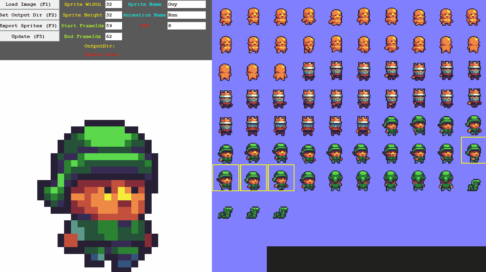

# Sprite Sheet Slicer

## Snapshot

## How to set an animation
- Set the start and end frame index and then using F5 to update. 
- Or click two frame in the right canvas directly.

## Export structure
- ~OutputDir/**SpriteName**/**AnimationName**/**AnimationName_Index.png**

## Reference
1. The sprite sheet here is made by Buch in OpenGameArt [Buch in OpenGameArt](https://opengameart.org/content/a-platformer-in-the-forestN)
